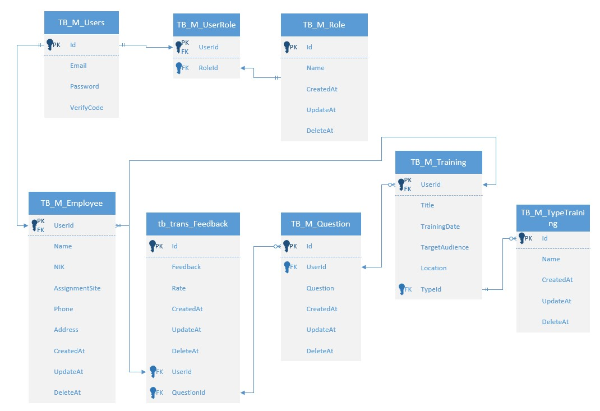
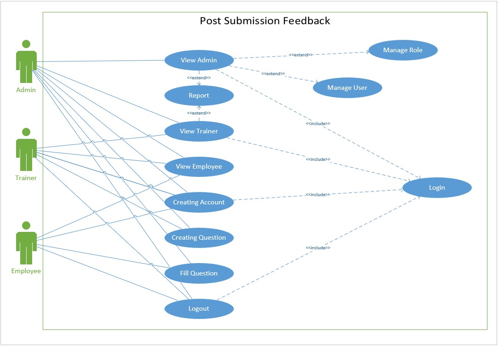
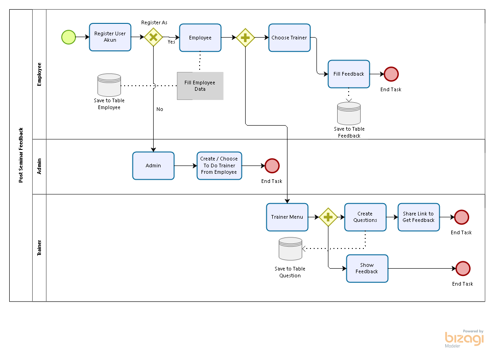

# Post Seminar Feedback

## [Table of Contents](#)

- [Progress](#progress)
- [SDLC](#sdlc)
    - [ERD Scheme](#ERD-Scheme)
    - [Use Case Diagram Scheme](#use-case-diagram-Scheme)
    - [BPMN Scheme](#bpmn-Scheme)

## Progress

- Senin (14/09):
    1. Membuat UseCase
    2. Membuat ERD
    3. Membuat BPMN

- Selasa (15/09):
Membuat Register, Login, dan Verify
Revisi UseCase, ERD, & BPMN
Revisi entity, bases, repo
Kesulitan Memakai GitDesktop => salah mengoperasikan membuat codingan hilang :(
Department, Division API
Rabu(16/09):
Membuat Register, Login, Verify.(API Revisi)

## SDLC

- `ERD` Scheme

- `Use Case Diagram` Scheme

- `BPMN` Scheme

